# Matrix Shader Gallery

This directory contains screenshots of all Matrix shader variations.

Screenshots are automatically generated by the GitHub Actions workflow and can be regenerated on demand.

## Gallery Images

_Click on any image to view it in full size._

### Classic Matrix

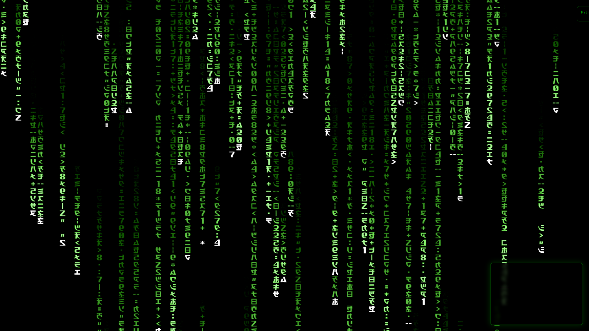

[View full size](classic-matrix.png)

### Matrix Resurrections

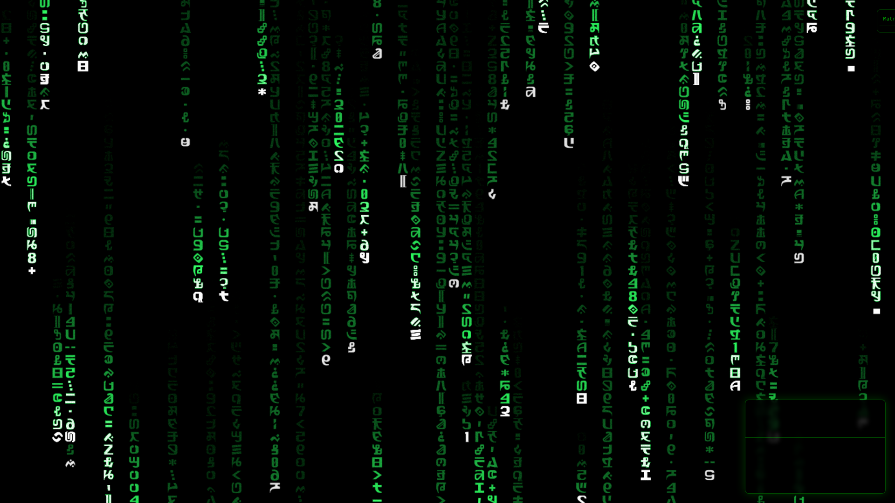

[View full size](resurrections.png)

### 3D Volumetric Mode

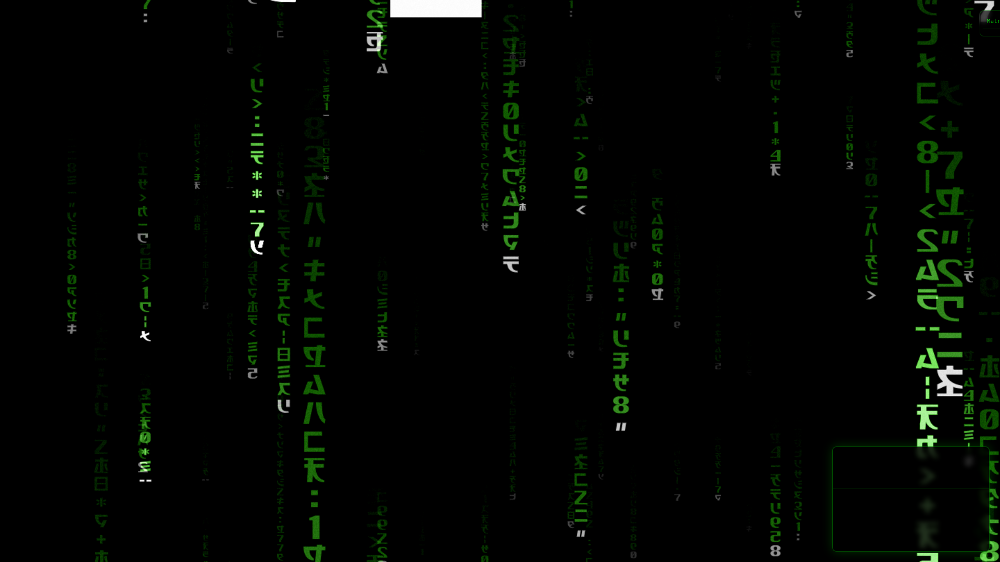

[View full size](3d-volumetric.png)

### Operator Console

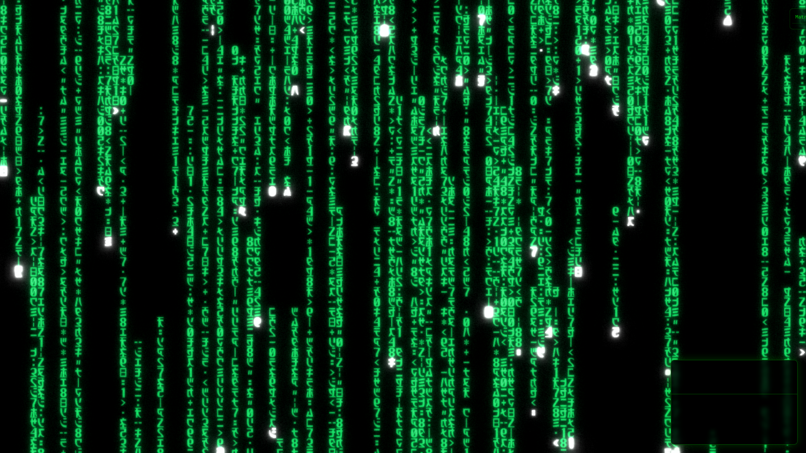

[View full size](operator.png)

### Nightmare Matrix

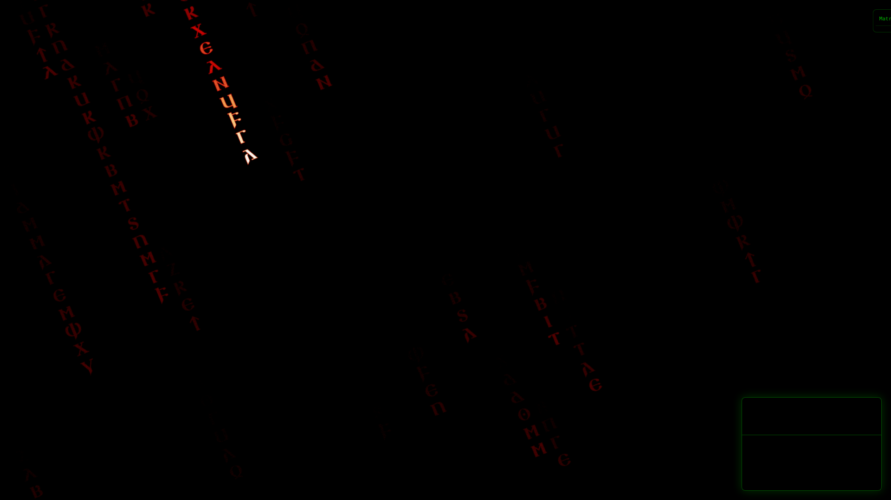

[View full size](nightmare.png)

### Paradise Matrix

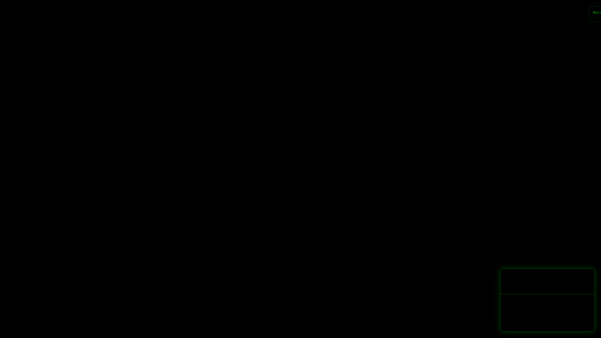

[View full size](paradise.png)

### Rainbow Spectrum

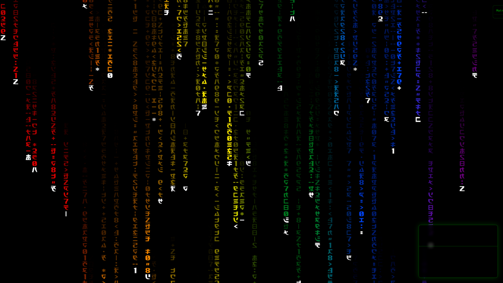

[View full size](rainbow.png)

### Light Spectrum

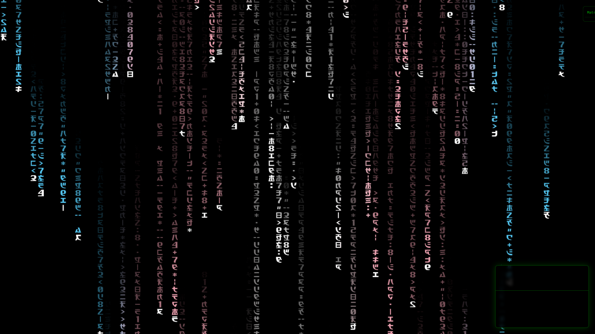

[View full size](spectrum.png)

### Custom Stripes (RGB)

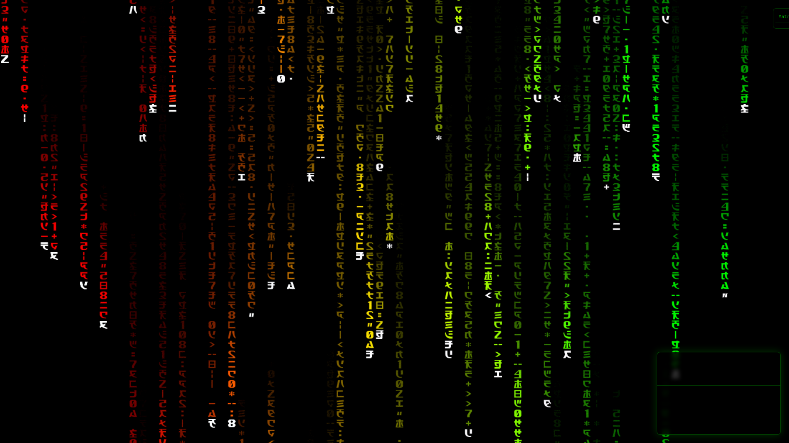

[View full size](stripes-rgb.png)

### Trinity Mode

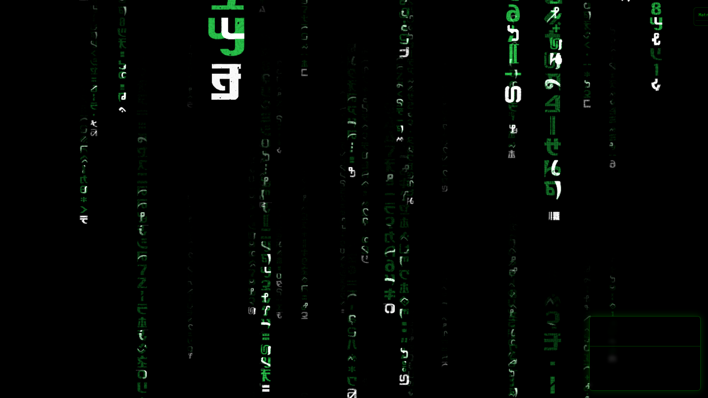

[View full size](trinity.png)

### Morpheus Mode

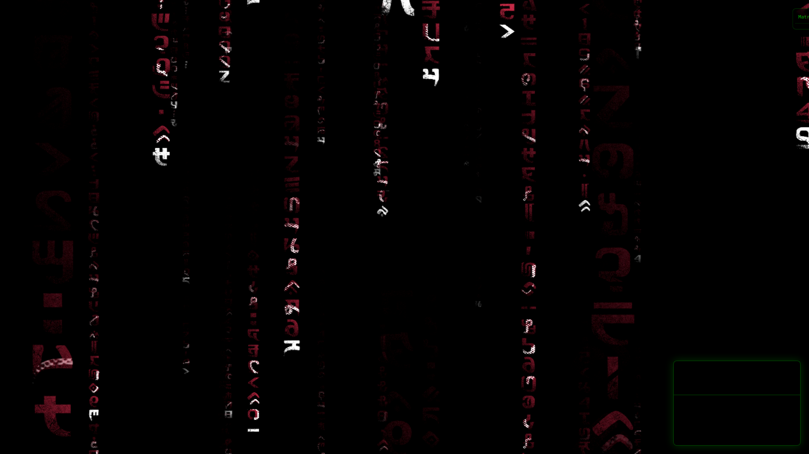

[View full size](morpheus.png)

### Megacity

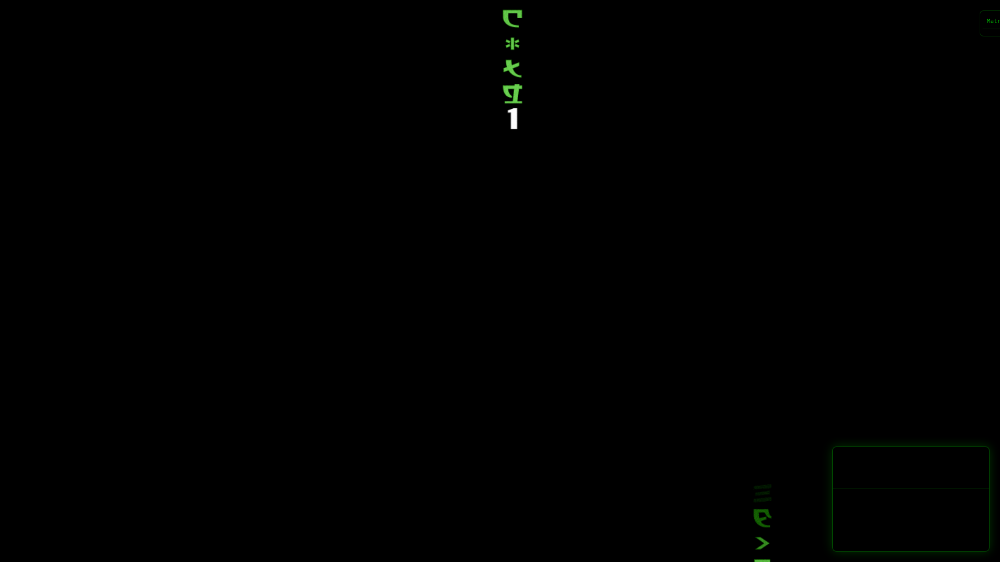

[View full size](megacity.png)

### Palimpsest

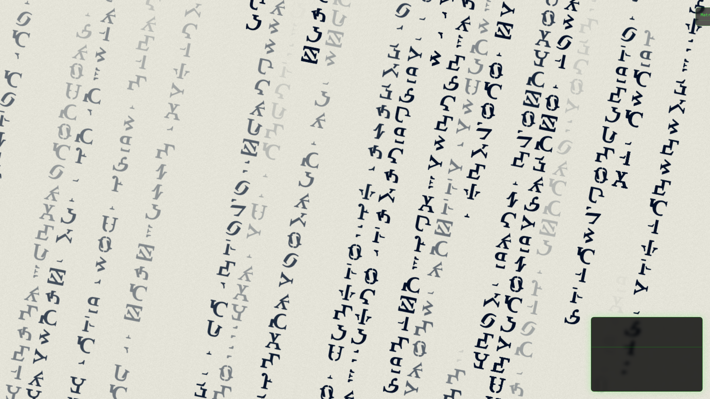

[View full size](palimpsest.png)

### Twilight

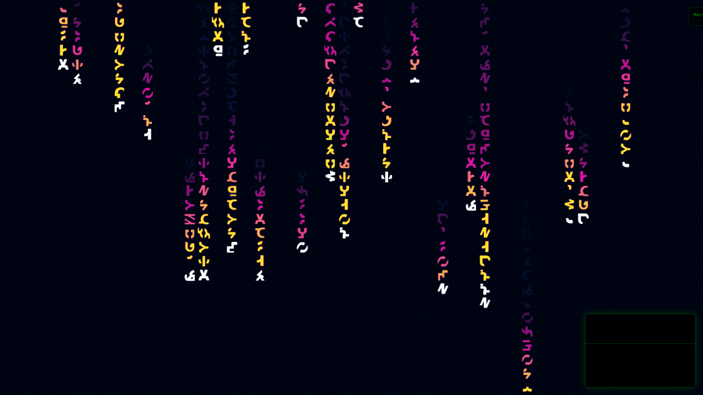

[View full size](twilight.png)

### Debug View

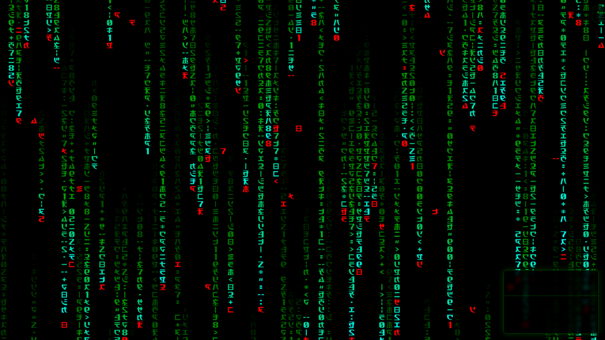

[View full size](debug.png)

